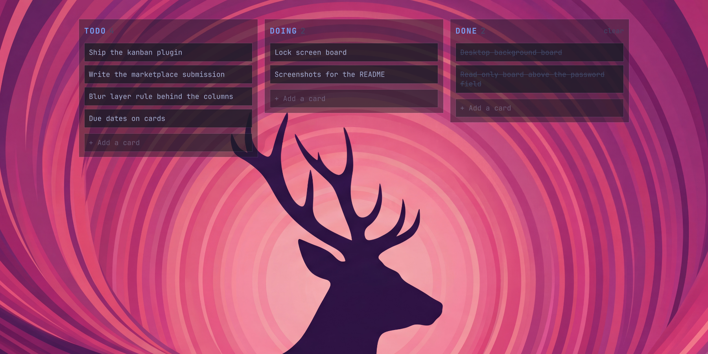
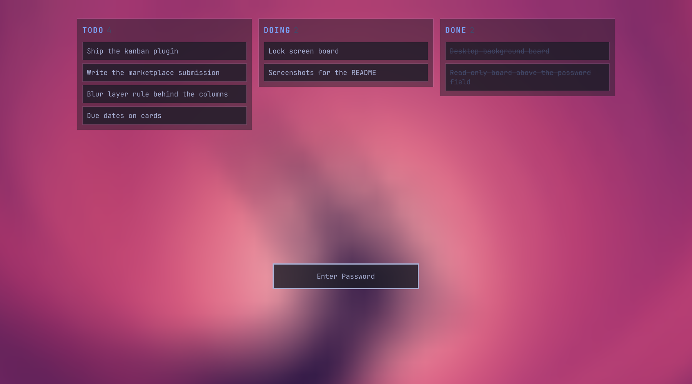

# Kanban for Omarchy

A kanban board of todo cards that lives on the desktop background, always
visible under your windows, and shows read-only on the lock screen. A plugin
for the Omarchy 4 shell (`omarchy-shell`, Quickshell).

Other kanban plugins open a panel from the bar. This one is the desktop: no
click to open, nothing to dismiss. Clear a workspace and the board is there.





- Three columns by default: Todo, Doing, Done. Columns are editable in the
  data file.
- Click a card to edit it: Enter saves, Escape cancels, Shift+Enter adds a
  line. Clearing the text and leaving deletes the card. Drag a card to move it
  between columns or to reorder.
- Hover a card for the edit and delete glyphs. The last column has a "clear"
  action in its header.
- Type in the field at the bottom of a column and press Enter to add a card.
- Cards persist in `~/.local/state/kanban/board.json`. The file is watched,
  so edits from a script or another Claude session appear at once.
- Clicks outside the board pass through to the wallpaper (double-click still
  opens the background picker).

## Install

```bash
omarchy plugin add https://github.com/hunterchristian/omarchy-kanban.git --enable
```

That gives you the desktop board. The lock screen is a separate, explicit
step because it replaces the built-in lock plugin with a personal clone:

```bash
~/.config/omarchy/plugins/hunterchristian.kanban/install-lock.sh
```

`install.sh` is the equivalent of `--enable` for a manual `git clone`. Both
scripts use shell IPC when `omarchy-shell` is running and edit
`~/.config/omarchy/shell.json` directly when it is not (for example over ssh).
Config edits made without the shell take effect at the next shell start.

## Remove

```bash
omarchy plugin remove <user>.lock            # only if you installed the lock screen
omarchy plugin remove hunterchristian.kanban
rm -rf ~/.local/state/kanban                 # your cards, if you want them gone too
```

Removing the lock clone switches the shell back to the built-in lock screen.

## Dependencies

Nothing beyond Omarchy 4: Quickshell (ships with Omarchy), `jq` and `awk`
for the install scripts. No network access, no sudo, no background daemons.

## Lock screen

The lock screen is Omarchy's `omarchy.lock` plugin. `install-lock.sh` makes
the same personal clone that `omarchy plugin clone omarchy.lock` makes, then
inserts one `Loader` (see `lock/LockView.kanban.qml`) into `LockView.qml`.
The board renders above the blurred wallpaper and above the password field,
read-only: no drag, no edit, no input focus.

The Loader means a broken board renders nothing rather than breaking the
password field.

A cloned plugin no longer receives Omarchy's own updates to the lock screen.
After an Omarchy update, rebuild the clone from the new built-in:

```bash
~/.config/omarchy/plugins/hunterchristian.kanban/install-lock.sh --force
```

To go back to the stock lock screen: `omarchy plugin remove <user>.lock`.

Anything on the board is visible to anyone at the locked machine. Keep client
names and secrets off it.

## IPC

```bash
omarchy-shell kanban add todo "Write the release notes"   # prints the new card id
omarchy-shell kanban move <id> doing
omarchy-shell kanban done <id>
omarchy-shell kanban remove <id>
omarchy-shell kanban clear done
omarchy-shell kanban list                                  # JSON
omarchy-shell kanban reload
```

## Data file

```json
{
  "version": 1,
  "columns": [
    { "id": "todo", "title": "Todo" },
    { "id": "doing", "title": "Doing" },
    { "id": "done", "title": "Done" }
  ],
  "cards": [
    { "id": "k3f9a1x", "column": "todo", "title": "Write the release notes",
      "order": 0, "createdAt": "2026-09-08T21:00:00.000Z" }
  ]
}
```

Invalid JSON is ignored and the last good state stays on screen. Cards whose
column no longer exists fall into the first column.

## Layout

- `Service.qml`: desktop window per screen on the `Bottom` layer-shell layer
  (above the wallpaper, below windows), the `kanban` IPC target.
- `KanbanBoard.qml`: the board. `readOnly` disables every interaction.
- `KanbanStore.qml`: the JSON file store.
- `LockBoard.qml`: read-only wrapper the lock clone loads.
- `lock/LockView.kanban.qml`: the snippet inserted into the cloned lock view.

## Contributing

See [CONTRIBUTING.md](CONTRIBUTING.md). MIT licensed.
